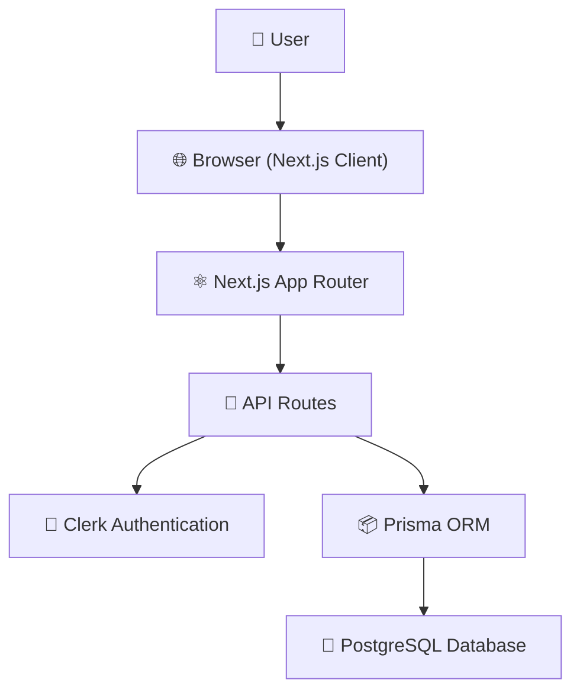

# NebulaPaste Architecture

## Overview

NebulaPaste follows a modern full-stack architecture built with Next.js App Router. It uses Clerk for authentication, Prisma as the ORM, and PostgreSQL for persistent data storage.

---

# High-Level Architecture



---

# Request Flow

1. User opens NebulaPaste.
2. Browser loads the Next.js application.
3. User authenticates through Clerk.
4. The frontend sends requests to API Routes.
5. API Routes validate authentication.
6. Prisma communicates with PostgreSQL.
7. Database returns the requested data.
8. Response is displayed to the user.

---

# Authentication Flow

```text
User
   │
   ▼
Clerk Authentication
   │
   ▼
User Session
   │
   ▼
Protected API Routes
```

Only authenticated users can:

- Create pastes
- Edit pastes
- Delete pastes
- Pin/Unpin pastes

---

# Database Layer

NebulaPaste uses:

- PostgreSQL
- Prisma ORM

Responsibilities:

- Store pastes
- Store user ownership
- Store pin status
- Retrieve data efficiently

---

# Folder Structure

```text
app/
│
├── api/
├── create/
├── paste/
├── my-pastes/
│
components/
│
├── home/
├── layout/
├── ui/
│
lib/
│
├── prisma.ts
│
prisma/
│
└── schema.prisma
```

---

# Technology Stack

| Layer | Technology |
|--------|------------|
| Frontend | Next.js 16 |
| Backend | Next.js API Routes |
| Authentication | Clerk |
| ORM | Prisma |
| Database | PostgreSQL |
| Styling | Tailwind CSS |
| Icons | Lucide React |
| Notifications | Sonner |

---

# Design Principles

- Component-based architecture
- RESTful API design
- Server-side data handling
- Secure authentication
- Modular folder structure
- Reusable UI components

---

# Future Improvements

- Docker deployment
- CI/CD pipeline
- Logging & monitoring
- Automated testing
- Health monitoring
- Horizontal scaling